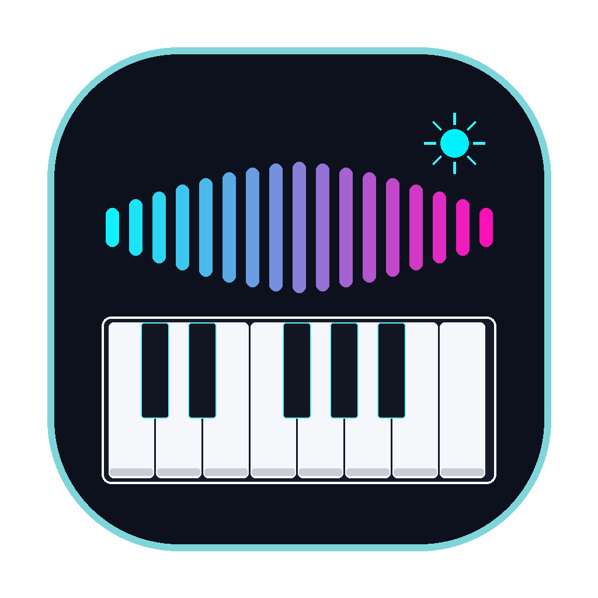

# ableton-agent 🎹🤖

<div align="center">
  
  <h3>Claude Code-Style AI Music Production Terminal for Ableton Live 11/12</h3>
  <p>Talk with an AI music producer directly inside your terminal, plan and build tracks, generate humanized grooves, and control Ableton Live via CLI or native MCP.</p>
</div>

---

```
  ╭─────────────────────────────────────────────────────────────╮
  │  ● ableton-agent v0.3.0                        ● LIVE CONNECTED │
  │  Claude Code-style AI Music Production Terminal             │
  │                                                             │
  │  Model: gpt-4o          Bridge: 127.0.0.1:9000 (12ms)       │
  │  API:   https://api.openai.com/v1                           │
  │                                                             │
  │  Type /help for slash commands, or talk in natural language. │
  ╰─────────────────────────────────────────────────────────────╯

ableton-agent ❯ make a driving tech house track at 126 BPM with rolling bass and 909 drums
● Thinking with gpt-4o...
● Executing in Ableton Live (5 commands):
  ├── [1/5] set_tempo(bpm=126.0)                   ✔ OK
  ├── [2/5] create_midi_track(name="Kick")         ✔ OK
  ├── [3/5] create_midi_track(name="Sub Bass")     ✔ OK
  ├── [4/5] create_clip(track=1, slot=0)           ✔ OK
  └── [5/5] add_notes(track=1, notes=8)            ✔ OK
✔ Done! Check Ableton Live.
```

## 🚀 Quick Install

```bash
pip install --upgrade git+https://github.com/HELBOYCODER/ableton-agent.git
# or from release wheel:
pip install ableton_agent-0.3.0-py3-none-any.whl
```

### 1-Click Remote Script Setup
Inside your terminal (or inside the interactive REPL):
```bash
ableton-agent install
# or inside the interactive REPL:
ableton-agent ❯ /install
```
Then in Ableton Live: **Preferences > Link, Tempo & MIDI > Control Surface = ChatGPTBridge**.

---

## 💻 Claude Code-Style Interactive Terminal

Just run `ableton-agent` with no arguments to launch the full interactive conversational terminal:

```bash
ableton-agent
```

### 💬 Chat in Natural Language
Speak in English or Persian:
- *"make a 124 BPM deep house groove with jazzy chords and rolling bass"*
- *"یه ریتم تکنو ۱۲۸ بساز با ساب‌بیس و کیک"*
- *"add a minor 9th chord on track 1"*
- *"what tracks and devices do I have currently?"*
- *"mute the bass track and solo track 1"*

### ⚡ Slash Commands

| Command | Description |
| :--- | :--- |
| `/help` | Show categorized reference and prompt examples |
| `/status` | Connection diagnostics, bridge latency, model, and ports |
| `/connect` | Ping and test connection to Ableton Live bridge |
| `/install` | 1-click install `ChatGPTBridge` into User Remote Scripts |
| `/live`, `/set` | Display live project tracks, tempo, devices & clips in a formatted table |
| `/play`, `/stop` | Instant Ableton transport playback control |
| `/tempo <bpm>` | Set project tempo (e.g. `/tempo 126`) |
| `/track <midi\|audio> [name]` | Quick-create a new track in Live |
| `/chord <root> [type]` | Generate harmonic chord (e.g. `/chord A2 min7`) & send to track |
| `/groove [hits] [steps]` | Generate Euclidean polyrhythm (e.g. `/groove 5 16`) |
| `/model [name]` | Switch LLM model (`gpt-4o`, `qwen2.5:14b`, `llama-3.3-70b`, `deepseek-chat`) |
| `/endpoint [url]` | Switch API base URL (Ollama, LM Studio, Groq, DeepSeek) |
| `/mcp` | Print MCP config JSON snippet for Claude Desktop / Cursor |
| `/dry` | Toggle dry-run mode (preview generated plan without sending to Live) |
| `/clear` | Clear terminal screen |
| `/exit`, `/quit` | Exit session |

---

## 🖥️ macOS 1-Click Desktop Launcher

For Mac users who prefer launching via Finder:
1. Download **[AbletonAgent-macOS.zip](https://github.com/HELBOYCODER/ableton-agent/releases/download/v0.3.0/AbletonAgent-macOS.zip)** from Releases.
2. Double-click **`AbletonAgent.command`** (or **`AbletonAgent.app`**).
3. Terminal.app immediately opens running `ableton-agent`!

---

## 🔌 Native Model Context Protocol (MCP) Server

Connect Claude Desktop, Cursor, or Minis directly to Ableton Live without extra dependencies:

```json
{
  "mcpServers": {
    "ableton-agent": {
      "command": "ableton-agent",
      "args": ["mcp"]
    }
  }
}
```

**Exposed MCP Tools:**
- `ableton_plan_and_run`: natural language prompt -> live plan execution
- `ableton_send_command`: execute raw Live actions (`play`, `stop`, `set_volume`...)
- `ableton_describe_set`: inspect tracks, loaded devices, clips, and tempo
- `ableton_generate_groove`: harmonic chords & Euclidean syncopated rhythms with velocity humanization
- `ableton_get_status`: inspect active model and UDP bridge config

---

## 🎼 Music Theory & Humanized Groove Engine

No robotic velocity-100 MIDI!
- **Velocity & Microtiming Curves**: Accents on beat 1 and 3, ghost notes on offbeats, and swing jitter.
- **Harmonic Chord Engine**: Computes min7, maj7, min9, dim, sus4, aug chords across all root keys.
- **Euclidean Rhythm Generator**: Algorithmic syncopated rhythms (Tresillo 3/8, Afro/House 5/16).

```bash
ableton-agent theory chord --root A2 --chord-type min7
ableton-agent theory euclidean --hits 5 --steps 16
```

---

## 🌐 Localhost & 100% Free AI Providers (Zero Cost)

`ableton-agent` is built with **first-class support for free models and localhost providers**. It auto-detects running local AI engines on your machine on startup:

```bash
# In the interactive terminal:
ableton-agent ❯ /provider
ableton-agent ❯ /provider ollama
ableton-agent ❯ /provider 9router
ableton-agent ❯ /provider openrouter-free

# Or via CLI flag:
ableton-agent providers --set ollama
ableton-agent providers --set 9router
```

| Provider | Type | Endpoint | Best Free Models |
| :--- | :--- | :--- | :--- |
| **Ollama** | 💻 Localhost | `http://localhost:11434/v1` | `qwen2.5:14b`, `llama3.1:8b`, `deepseek-r1:14b` |
| **LM Studio** | 💻 Localhost | `http://localhost:1234/v1` | Any loaded model (`local-model`) |
| **9Router** | 💻 Localhost | `http://localhost:20128/v1` | `oc/mimo-v2.5-free`, `oc/ling-3.0-flash-fin-free` |
| **OpenRouter Free** | ☁️ Cloud (Free) | `https://openrouter.ai/api/v1` | `google/gemini-2.0-flash-exp:free`, `meta-llama/llama-3.3-70b-instruct:free` |
| **Groq Cloud** | ☁️ Cloud (Free Tier) | `https://api.groq.com/openai/v1` | `llama-3.3-70b-versatile` (lightning fast) |
| **Google Gemini** | ☁️ Cloud (Free Tier) | `https://generativelanguage.googleapis.com` | `gemini-2.0-flash` (15 RPM free) |
| **LocalAI** | 💻 Localhost | `http://localhost:8080/v1` | Self-hosted local models |
| **Jan.ai** | 💻 Localhost | `http://localhost:1337/v1` | `mistral-ins-7b-q4` |
| **OpenAI** | ☁️ Cloud | `https://api.openai.com/v1` | `gpt-4o`, `gpt-4o-mini` |

### 🛡️ Smart Offline Heuristic Music Engine (0 API Keys / 0 Tokens)
If you have no API key configured and no local LLM running, `ableton-agent` **never crashes or stops working**. It seamlessly activates its built-in rule-based music producer (`theory.py`) to generate authentic, humanized multi-track arrangements (Tech House, Techno, Lo-Fi Chill, Dark Ambient, Afrobeat) completely offline!

---

## 📦 Single-Line CLI Commands (Non-Interactive)

```bash
# One-shot build with specific provider
ableton-agent run "make a minimal techno groove at 130 BPM"
ableton-agent run --dry-run "lo-fi beat at 82 BPM"

# List and switch providers
ableton-agent providers
ableton-agent providers --set ollama --model qwen2.5:14b

# Quick transport & query
ableton-agent send play
ableton-agent send stop
ableton-agent describe
```

---

## 🛠️ Testing & CI

Every commit and tag runs tests on Python 3.9, 3.11, and 3.12:
```bash
python -m compileall -q src
ableton-agent --version
echo -e "/help\n/status\n/exit" | ableton-agent
```
